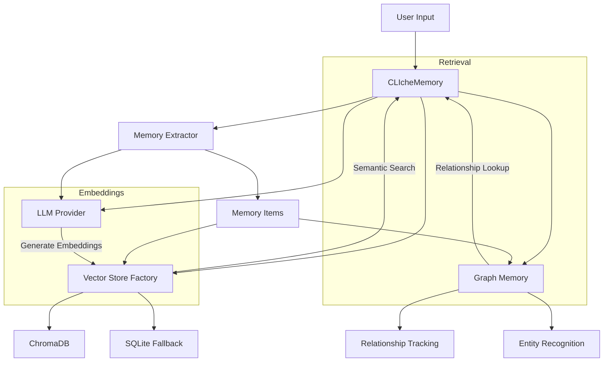

# CLIche Memory System Redesign

✨ *Made with ❤️ by Pink Pixel*

## Overview

This document outlines the plan to completely redesign CLIche's memory system using mem0's architecture as the foundation. Instead of trying to fix the current dual storage system, we'll leverage mem0's proven implementation that offers a clean, modular approach with multi-provider support.

## Current Issues

1. **Dual Storage System Confusion**: The current system uses both SQLite and ChromaDB, creating synchronization issues and making it difficult to track which system is used when.

2. **Embedding Provider Limitations**: Current implementation only works well with Ollama, lacking proper support for other providers.

3. **Inconsistent Memory Retrieval**: The current system often fails to retrieve memories properly due to the disconnection between storage systems.

4. **Entity Extraction Errors**: The entity extraction system has unresolved issues with type errors.

## mem0 Advantages

1. **Single Vector Store**: Uses one vector store (ChromaDB by default) for all memory operations.

2. **Multi-Provider Support**: Built-in support for multiple embedding providers and LLM providers.

3. **Factory Pattern**: Clean architecture with factories for creating embedders, LLMs, and vector stores.

4. **Automatic Model Download**: Checks if embedding models are available and downloads them if needed.

5. **Comprehensive Graph Memory**: Well-implemented graph-based memory system for entity relationships.

## Implementation Plan

### Phase 1: Core Infrastructure (Estimated time: 3-4 days)

1. **Create New Directory Structure**:
   ```
   cliche/
   ├── memory/
   │   ├── __init__.py
   │   ├── main.py           # Main Memory class
   │   ├── config.py         # Configuration definitions
   │   ├── vector_stores/    # Vector store implementations
   │   │   ├── __init__.py
   │   │   ├── base.py
   │   │   ├── chroma.py
   │   │   ├── factory.py
   │   ├── embeddings/       # Embedding provider implementations
   │   │   ├── __init__.py
   │   │   ├── base.py
   │   │   ├── ollama.py
   │   │   ├── openai.py
   │   │   ├── anthropic.py
   │   │   ├── factory.py
   │   ├── utils/           # Utility functions
   ```

2. **Implement Vector Store Base Classes**:
   - Create abstract base class for vector stores
   - Implement ChromaDB as primary vector store
   - Create factory for vector store creation

3. **Implement Embedding Providers**:
   - Create abstract base class for embedding providers
   - Implement providers for Ollama, OpenAI, etc.
   - Create factory for embedding provider creation

4. **Configure Memory System**:
   - Create configuration classes for memory, embeddings, and vector stores
   - Implement configuration loading and validation

### Phase 2: Core Memory Functionality (Estimated time: 3-4 days)

1. **Implement Main Memory Class**:
   - Add/store memories
   - Search for memories
   - Retrieve memories
   - Count memories

2. **Implement Memory Extraction**:
   - Extract facts and preferences from conversations
   - Handle entity relationships
   - Support multiple LLM providers for extraction

3. **Add Migration Tool**:
   - Create tool to migrate existing memories from SQLite to new system
   - Ensure backward compatibility for existing users

### Phase 3: CLI Commands and Integration (Estimated time: 2-3 days)

1. **Update CLI Commands**:
   - Modify existing `memory` commands to use new system
   - Add new commands for enhanced functionality
   - Update help documentation

2. **Integrate with Existing Components**:
   - Update `ask` and `chat` commands to use new memory system
   - Modify core CLIche class to initialize new memory system
   - Ensure proper error handling and fallbacks

3. **Add Model Management**:
   - Implement model downloading functionality
   - Add commands to list, download, and manage models
   - Support for both small and large embedding models

### Phase 4: Testing and Refinement (Estimated time: 2-3 days)

1. **Create Comprehensive Tests**:
   - Unit tests for each component
   - Integration tests for the entire system
   - Performance benchmarks

2. **Documentation**:
   - Update user documentation
   - Create developer documentation
   - Add examples and usage guidance

3. **Final Review and Refinement**:
   - Performance optimization
   - Code cleanup
   - Final testing across all providers

## Technical Details

### Embedding Model Options

We'll support multiple embedding models with different size/performance tradeoffs:

1. **Small Models (Fast, Lower Quality)**:
   - `mxbai-embed-small` (384 dimensions)
   - `nomic-embed-text` (768 dimensions)
   - `all-minilm` (384 dimensions)

2. **Large Models (Slower, Higher Quality)**:
   - `mxbai-embed-large` (1024 dimensions)
   - `nomic-embed-text-v1.5` (768 dimensions, higher quality)
   - `e5-large-v2` (1024 dimensions)

The model choice affects:
- **Quality**: Larger models generally provide better semantic understanding
- **Speed**: Smaller models are faster to run, especially on CPU
- **Storage**: Larger models require more disk space
- **Memory Usage**: Larger models require more RAM

We'll implement a configuration option to select the model size based on user needs.

### Multi-Provider Embeddings

For non-Ollama providers, we need to:

1. **API Integration**:
   - Use respective client libraries (OpenAI, Anthropic, etc.)
   - Handle authentication and API limits
   - Provide proper error handling and retries

2. **Dimension Standardization**:
   - Each provider outputs embeddings with different dimensions
   - Implement proper handling of dimension differences
   - Use dimension reduction or padding when necessary

3. **Fallback Mechanisms**:
   - If a provider is unavailable, fall back to a local option
   - Cache embeddings to reduce API calls
   - Provide clear error messages for API issues

Embeddings will be generated at these key points:
- When storing a new memory
- When searching for memories with a query
- When updating an existing memory

### ChromaDB Integration

We'll use ChromaDB as our primary vector store because:

1. **Performance**: Optimized for semantic search
2. **Ease of Use**: Simple Python API
3. **Flexibility**: Works with multiple embedding dimensions
4. **Persistence**: Built-in disk storage
5. **Active Development**: Regular updates and improvements

The ChromaDB integration will:
- Store both memory content and metadata in one place
- Handle dimension mismatches automatically
- Support filtering by metadata (user_id, memory type, etc.)
- Provide efficient similarity search

## Migration Strategy

To ensure a smooth transition for existing users:

1. **Database Migration Tool**:
   - Read all memories from SQLite
   - Generate embeddings using the configured provider
   - Store in new ChromaDB collection
   - Preserve all metadata and timestamps

2. **Backward Compatibility**:
   - Support reading from old memory locations
   - Convert old memory format to new format
   - Provide clear upgrade instructions

3. **Verification Process**:
   - Count memories before and after migration
   - Verify search functionality with test queries
   - Ensure all metadata is preserved

## Expected Improvements

1. **Reliability**: Single source of truth for memories
2. **Performance**: Better semantic search through optimized embeddings
3. **Flexibility**: Easy to switch between providers
4. **Maintainability**: Clean, modular code structure
5. **Extensibility**: Easier to add new features

## Conclusion

This redesign represents a major improvement to CLIche's memory system, leveraging the proven architecture of mem0 to create a more reliable, flexible, and powerful memory layer. By focusing on a clean implementation from the start rather than fixing existing issues, we'll create a solid foundation for future enhancements.

## Architecture



## Directory Structure

```
cliche/
└── memory/
    ├── __init__.py
    ├── types.py           # Shared types and classes
    ├── memory.py          # Main CLIcheMemory class (high-level API)
    ├── extractor.py       # Memory extraction logic
    ├── embeddings.py      # Embedding generation
    ├── categorizer.py     # Memory categorization
    ├── graph.py           # Graph-based memory relationships
    ├── config.py          # Configuration handling
    └── stores/            # Vector store implementations
        ├── __init__.py
        ├── base.py        # Abstract base class
        ├── chroma.py      # ChromaDB implementation
        └── sqlite.py      # SQLite implementation (fallback)
```

## Implementation Plan

### Phase 1: Vector Store Refactoring

1. **Create Base Vector Store Interface**
   - Define a common interface for all vector stores
   - Implement methods for add, search, update, delete

2. **Implement ChromaDB Store**
   - Add ChromaDB as a dependency
   - Implement ChromaDB vector store class
   - Support persistence, embeddings, and metadata

3. **Refactor Existing Code**
   - Move SQLite vector storage to a dedicated class
   - Implement factory pattern for vector store creation
   - Update configuration to support store selection

### Phase 2: Graph-Based Memory

1. **Design Memory Graph Structure**
   - Define entity and relationship models
   - Create graph operations (add, query, update)

2. **Implement Graph Memory**
   - Create in-memory graph for development
   - Add persistence layer
   - Implement relationship detection

3. **Integrate with Memory System**
   - Update memory add/search to use graph relationships
   - Enhance memory retrieval with relationship context

### Phase 3: Query Enhancement

1. **Improve Memory Retrieval**
   - Implement hybrid search (vector + graph)
   - Add metadata filtering
   - Support time-based queries

2. **Implement Memory Operations**
   - Add/update/delete memories
   - Memory summarization
   - Conflict resolution

### Phase 4: Testing and Documentation

1. **Create Test Suite**
   - Unit tests for each component
   - Integration tests for the entire system
   - Performance benchmarks

2. **Update Documentation**
   - API documentation
   - Usage examples
   - Configuration guide

## Detailed Technical Specifications

### ChromaDB Integration

ChromaDB will be the primary vector store for CLIche, offering:

- Persistent storage of embeddings and metadata
- Fast semantic search capabilities
- Advanced filtering and collection management
- Scalability for large memory sets

Configuration will be added to support ChromaDB:

```json
{
  "memory": {
    "enabled": true,
    "vector_store": "chroma",
    "chroma": {
      "persist_directory": "~/.config/cliche/memory/chroma",
      "collection_name": "cliche_memories"
    }
  }
}
```

### Graph Memory Structure

The graph memory component will track relationships between memories:

- Entity detection (people, places, things)
- Relationship types (has, knows, likes, dislikes, etc.)
- Temporal relationships (before, after, during)
- Contextual relationships (related to, part of, etc.)

```python
class MemoryEntity:
    id: str
    type: str  # person, place, object, concept
    name: str
    properties: Dict[str, Any]

class MemoryRelationship:
    source_id: str
    target_id: str
    type: str
    properties: Dict[str, Any]
```

### Memory Extraction Enhancement

Improve fact extraction by:

- Detecting entities and relationships in text
- Categorizing memories by type and topic
- Extracting user preferences and personal information
- Identifying actions and plans

## Migration Strategy

Since the memory system is unreleased, we'll implement the new design without a migration path. Once stabilized, we can:

1. Create a "first-run" detection system
2. Initialize ChromaDB with appropriate collections
3. Provide fallback mechanisms for edge cases

## Testing Strategy

Testing will be comprehensive and modular:

1. **Unit Tests**: For each component (extractor, vector store, graph, etc.)
2. **Integration Tests**: For the entire memory system
3. **Performance Tests**: For memory operations under load
4. **User Scenario Tests**: For real-world usage patterns

## Next Steps

1. Implement base vector store interface
2. Add ChromaDB integration
3. Create graph memory component
4. Update memory extractor to support entity detection
5. Integrate all components in the main CLIcheMemory class
6. Create comprehensive test suite
7. Update documentation and examples 